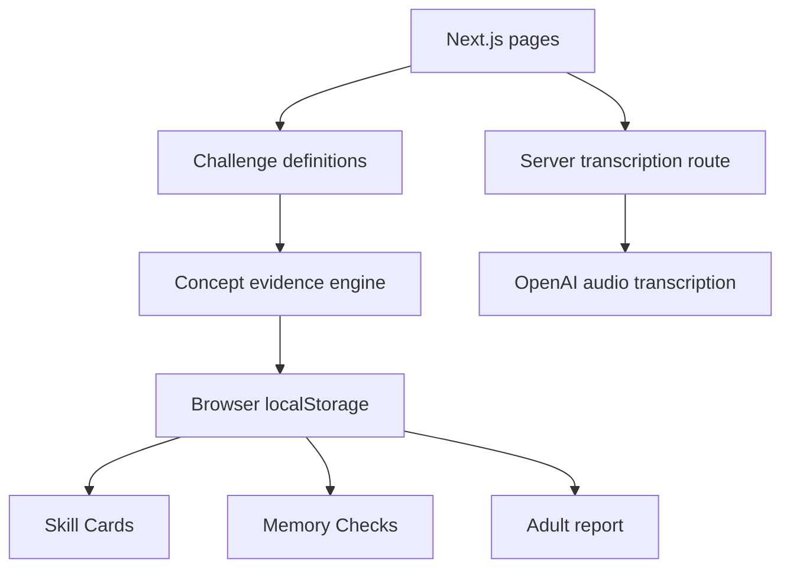

# ProofPlay — product and submission notes

## Product statement

ProofPlay turns a learner's explanation or demonstration into evidence of understanding, then checks later whether that learning was remembered.

## Core problem

Completion data is not the same as understanding. A finished lesson or certificate does not necessarily prove that a learner can explain, apply, or retain the idea.

## Core loop

1. Pick a challenge.
2. Explain or demonstrate the answer.
3. Review the detected concept evidence.
4. Save a Living Skill Card.
5. Return for a Memory Check.
6. Review progress in the adult view.

## Product decisions

- Use **young learners**, not age-based labels.
- Keep challenges short and demonstration-focused.
- Make the learner's own explanation the primary evidence.
- Show what was demonstrated and what still needs work.
- Treat retention as a separate signal from first-time performance.
- Keep the hackathon demo usable without account creation.
- Store prototype records locally so the experience is immediate.

## Routes

| Route | Responsibility |
|---|---|
| `/` | Product story |
| `/dashboard` | Challenge and evidence workflow |
| `/skills` | Saved skills |
| `/proof-card` | Skill Card detail |
| `/memory-checks` | Retention checks |
| `/grown-up` | Adult progress summary |

## Architecture

## Honest prototype boundaries

- Transcription uses an AI service; assessment currently uses transparent challenge-specific rules.
- Learning records are browser-local and do not sync across devices.
- Authentication pages are placeholders and are not required for the demo.
- The adult report is generated from the current browser's saved cards.
- ProofPlay supports learning evidence; it does not make formal educational or diagnostic decisions.

## What “submission ready” means

A reviewer should be able to:

1. understand the problem from the repository opening;
2. open a working deployment;
3. finish one challenge without creating an account;
4. see how the learner's explanation becomes evidence;
5. save and inspect a Skill Card;
6. understand the retention loop;
7. identify the real technology and current limitations; and
8. run the project locally from documented instructions.
