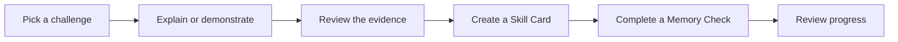
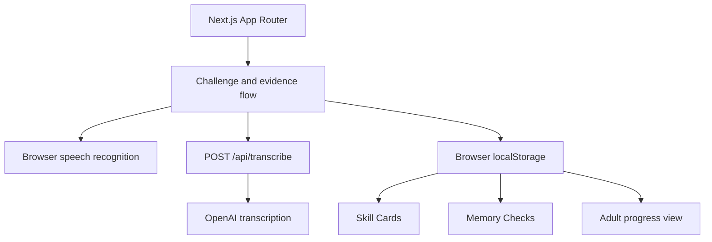

# ProofPlay

**Learning you can actually prove.**

ProofPlay is an evidence-based learning experience for young learners. Instead of rewarding completion alone, it asks learners to explain or demonstrate what they understand, turns that evidence into a Living Skill Card, and checks later whether the learning was remembered.

[Open the live demo](https://proofplay-alpha.vercel.app) · [View the repository](https://github.com/donatofaith/proofplay)

> **Pick a challenge → explain it → create proof → check retention**

Built as a hackathon prototype exploring a better answer to one question: **How can digital learning show real understanding, not just task completion?**

## The problem

Online learning commonly records lessons opened, quizzes completed, and certificates earned. Those signals do not always show whether a learner can explain an idea independently, apply it, or remember it later.

ProofPlay captures the learner's own explanation and connects it to a growing record of demonstrated skills.

## What ProofPlay does

- Offers nine challenges across Science, Mathematics, and Reading.
- Accepts spoken or written explanations and supporting images.
- Transcribes recorded explanations through a server-side API route.
- Checks explanations against the important concepts for each challenge.
- Creates Living Skill Cards containing the evidence and feedback.
- Runs later Memory Checks to measure retention.
- Gives adults a clear progress view and downloadable learning report.
- Stores the prototype's learning record locally in the browser.

## Product flow



## Main product surfaces

| Route | Purpose |
|---|---|
| `/` | Product introduction and explanation |
| `/dashboard` | Challenge selection, recording, evidence review, and Skill Card creation |
| `/skills` | Saved learning evidence and demonstrated skills |
| `/proof-card` | Detailed Living Skill Card |
| `/memory-checks` | Follow-up checks that measure whether learning was retained |
| `/grown-up` | Adult progress view and downloadable report |

## Judge path

A judge can understand the core experience quickly:

1. Open the [live demo](https://proofplay-alpha.vercel.app).
2. Select **Try ProofPlay**.
3. Choose a Science, Mathematics, or Reading challenge.
4. explain the answer using voice or text and optionally add an image.
5. Review the concept evidence and create the Skill Card.
6. Open **My Skills** to see the saved proof.
7. Complete a **Memory Check**.
8. Open the grown-up view to review progress and download the report.

## How the evidence works

Each challenge defines the concepts and reasoning language expected in a strong explanation. ProofPlay compares the learner's response with those requirements and produces:

- proof strength;
- concepts demonstrated;
- concepts that need more explanation;
- explanation feedback;
- level of independence; and
- a future Memory Check.

Voice transcription uses OpenAI's transcription API. The current prototype's educational scoring is a transparent, challenge-specific rules system rather than a claim of automated expert assessment.

## Run locally

```bash
git clone https://github.com/donatofaith/proofplay.git
cd proofplay
npm install
cp .env.example .env.local
npm run dev
```

Open [http://localhost:3000](http://localhost:3000).

Add the following server-side environment variable to `.env.local`:

```env
OPENAI_API_KEY=your_openai_api_key
```

The key is used only by `/api/transcribe`. Never expose it through a `NEXT_PUBLIC_` variable or commit it to GitHub.

## Architecture



## Technology

- Next.js 16 App Router
- React 19
- TypeScript
- Tailwind CSS
- Motion
- OpenAI audio transcription
- Browser Speech Recognition
- Browser localStorage
- Vercel

## Privacy and security

- The OpenAI key remains server-side.
- Audio uploads are validated and limited to 25 MB.
- The transcription endpoint returns only the transcript or a safe error.
- Prototype learning records remain in the user's browser.
- No password, payment, or public profile is required for the current demo.
- Uploaded evidence is used inside the active browser experience and is not presented as permanent cloud storage.

## Development checks

```bash
npm run lint
npm run build
```

## Current scope

ProofPlay is a working hackathon prototype, not a replacement for a teacher or formal educational assessment. The current version demonstrates the complete evidence loop without accounts or a shared database. Production development would add verified learner accounts, protected cloud storage, educator-created challenges, consent controls, and deeper assessment validation.

## Creator

Built by **Faith Oluwalana**.

- GitHub: [@donatofaith](https://github.com/donatofaith)
- Live product: [proofplay-alpha.vercel.app](https://proofplay-alpha.vercel.app)
